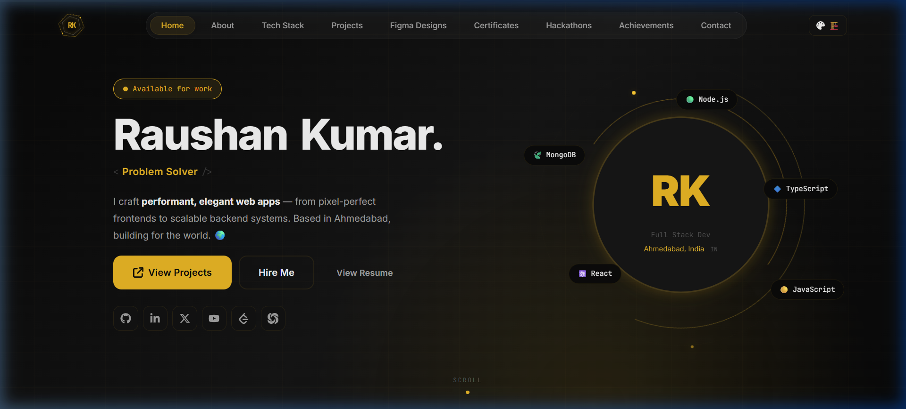
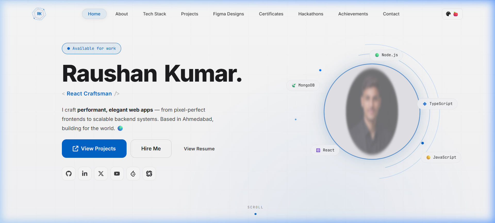
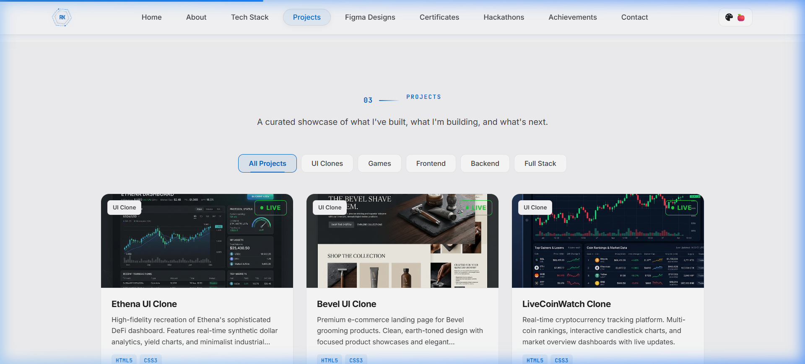
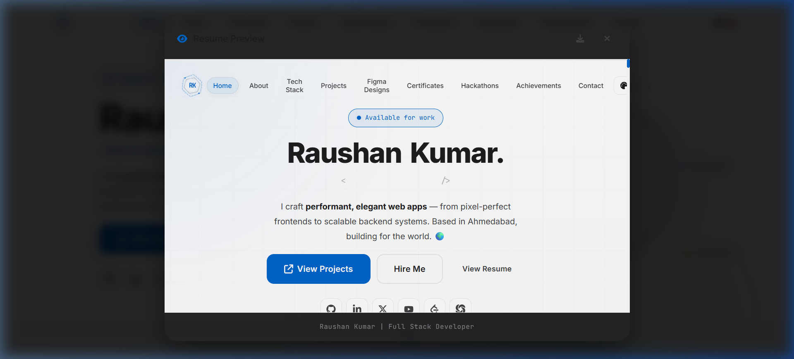

# Raushan Kumar | Digital Portfolio 🚀

[](https://choosealicense.com/licenses/mit/)
[](https://reactjs.org/)
[](https://vitejs.dev/)
[](https://www.framer.com/motion/)

A professional, high-performance personal portfolio built with **React.js** and **Vite**, featuring a premium design system, multi-theme support, and smooth choreographed animations.

---

## 🌟 Live Demo
[View Live Site](https://raushankumar-dev.vercel.app/)

---

## 📸 Visual Showcase

### 🏗️ Industrial Midnight Theme (Default)


### 🍎 Cupertino Theme (Apple Style)


### 📂 Dynamic Project Showcase


### 📄 Professional Resume Viewer


---

## ✨ Key Features

- **🎯 Interactive Aura & Grid**: Dynamic mouse-tracking background effects in the Hero section.
- **🎨 5 Premium Curated Themes**:
  - **Industrial**: High-contrast Midnight & Gold 🏗️
  - **Cupertino**: Minimalist Apple-inspired design 🍎
  - **Nordic**: Clean Gallery aesthetic ❄️
  - **Organic**: Futuristic Cyber Emerald 🍀
  - **Dark**: Classic Developer look 🌙
- **📄 Advanced Resume Modal**: View resume directly in-browser with a high-end PDF viewer (no mandatory downloads).
- **🎨 Figma Design Integration**: Dedicated section to showcase UI/UX work with direct Figma links.
- **🏆 Achievements Timeline**: A chronological showcase of academic and hobbyist milestones.
- **🕹️ Games Category**: Integrated projects for Game Development.
- **📱 Fully Responsive**: Pixel-perfect layout across Mobile, Tablet, and Desktop.
- **🚀 Advanced Animations**: Leverages **Framer Motion** for magnetic elements, staggered reveals, and smooth transitions.

---

## 🛠️ Tech Stack

- **Frontend**: React.js (Hooks, Context API)
- **Styling**: Vanilla CSS (Custom Variable Design System)
- **Animation**: Framer Motion, React-Spring
- **Build Tool**: Vite
- **Form Handling**: EmailJS
- **Icons**: React-Icons (Fa6, Hi, Io5)

---

## 📁 Project Structure

```bash
├── public/                # Static assets & screenshots
├── src/
│   ├── components/
│   │   ├── layout/        # Navbar, Footer
│   │   ├── sections/      # Hero, About, Projects, Figma, etc.
│   │   └── ui/            # Reusable components (Buttons, Modals, Cards)
│   ├── context/           # Theme Management
│   ├── data/              # Project and Achievement dataset
│   ├── hooks/             # Custom React Hooks
│   ├── styles/            # Theme variables and global styles
│   └── utils/             # Helper constants and scroll logic
└── index.html             # Entry point with SEO tags
```

---

## 🚀 Getting Started

1. **Clone the Repo**
   ```bash
   git clone https://github.com/RaushanKumar/raushan-portfolio.git
   ```

2. **Install Dependencies**
   ```bash
   npm install
   ```

3. **Run Dev Server**
   ```bash
   npm run dev
   ```

4. **Build for Production**
   ```bash
   npm run build
   ```

---

## 🏆 Checklist Completion (Academic Requirements)

- [x] **Technical**: Built with React & Vite.
- [x] **SEO**: Meta tags, Title tags, Sitemap, and Robots.txt configured.
- [x] **Responsiveness**: Mobile-first fluid design.
- [x] **Content**: Achievements, Figma Designs, and Games sections included.
- [x] **Functionality**: No auto-download Resume (Pre-view Modal implemented).
- [x] **Identity**: Full Name and Professional Photo in Hero.

---

## 📄 License
This project is [MIT](https://choosealicense.com/licenses/mit/) licensed.

---
*Crafted with 💻 by [Raushan Kumar](https://github.com/Raushankumar0720)*
